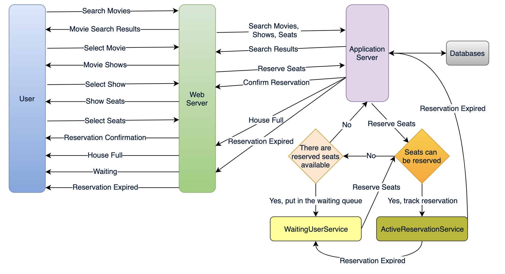

# Ticketmaster

### **Functional Requirements**

1. Our ticket booking service should be able to list different cities where its affiliate cinemas are located.
2. Once the user selects the city, the service should display the movies released in that particular city.
3. Once the user selects a movie, the service should display the cinemas running that movie and its available showtimes.
4. The user should be able to choose a show at a particular cinema and book their tickets.
5. The service should be able to show the user the seating arrangement of the cinema hall. The user should be able to select multiple seats according to their preference.
6. The user should be able to distinguish available seats from booked ones.
7. Users should be able to put a hold on the seats for five minutes before they make a payment to finalize the booking.
8. The user should be able to wait if there is a chance that the seats might become available, e.g., when holds by other users expire.
9. Waiting customers should be serviced in a fair, first come, first serve manner.

### **Non-Functional Requirements**

1. The system would need to be highly concurrent. There will be multiple booking requests for the same seat at any particular point in time. The service should handle this gracefully and fairly.
2. The core thing of the service is ticket booking, which means financial transactions. This means that the system should be secure and the database ACID compliant.

### Considerations

1. For simplicity, let’s assume our service does not require any user authentication.
2. The system will not handle partial ticket orders. Either user gets all the tickets they want or they get nothing.
3. Fairness is mandatory for the system.
4. To stop system abuse, we can restrict users from booking more than ten seats at a time.
5. We can assume that traffic would spike on popular/much-awaited movie releases and the seats would fill up pretty fast. The system should be scalable and highly available to keep up with the surge in traffic.

### Capacity

**Traffic estimates:** Let’s assume that our service has 3 billion page views per month and sells 10 million tickets a month.

**Storage estimates:** Let’s assume that we have 500 cities and, on average each city has ten cinemas. If there are 2000 seats in each cinema and on average, there are two shows every day.

Let’s assume each seat booking needs 50 bytes (IDs, NumberOfSeats, ShowID, MovieID, SeatNumbers, SeatStatus, Timestamp, etc.) to store in the database. We would also need to store information about movies and cinemas; let’s assume it’ll take 50 bytes. So, to store all the data about all shows of all cinemas of all cities for a day:500 cities \* 10 cinemas \* 2000 seats \* 2 shows \* (50+50) bytes = 2GB / day

To store five years of this data, we would need around 3.6TB.

### API

We can have SOAP or REST APIs to expose the functionality of our service. The following could be the definition of the APIs to search movie shows and reserve seats.

```
SearchMovies(api_dev_key, keyword, city, lat_long, radius, start_datetime, end_datetime, 
postal_code, includeSpellcheck, results_per_page, sorting_order)
```

**Parameters:**\
**api\_dev\_key (string):** The API developer key of a registered account. This will be used to, among other things, throttle users based on their allocated quota.\
**keyword (string):** Keyword to search on.\
**city (string):** City to filter movies by.\
**lat\_long (string):** Latitude and longitude to filter by.\
**radius (number):** Radius of the area in which we want to search for events.\
**start\_datetime (string):** Filter movies with a starting datetime.\
**end\_datetime (string):** Filter movies with an ending datetime.\
**postal\_code (string):** Filter movies by postal code / zipcode.\
**includeSpellcheck (Enum: “yes” or “no”):** Yes, to include spell check suggestions in the response.\
**results\_per\_page (number):** Number of results to return per page. Maximum is 30.\
**sorting\_order (string):** Sorting order of the search result. Some allowable values : ‘name,asc’, ‘name,desc’, ‘date,asc’, ‘date,desc’, ‘distance,asc’, ‘name,date,asc’, ‘name,date,desc’, ‘date,name,asc’, ‘date,name,desc’.

**Returns: (JSON)**\
Here is a sample list of movies and their shows:

```
[
  {
    "MovieID": 1,
    "ShowID": 1,
    "Title": "Cars 2",
    "Description": "About cars",
    "Duration": 120,
    "Genre": "Animation",
    "Language": "English",
    "ReleaseDate": "8th Oct. 2014",
    "Country": USA,
    "StartTime": "14:00",
    "EndTime": "16:00",
    "Seats": 
    [
      {  
        "Type": "Regular"
        "Price": 14.99
        "Status: "Almost Full"
      },
      {  
        "Type": "Premium"
        "Price": 24.99
        "Status: "Available"
      }
    ]
  },
  {
    "MovieID": 1,
    "ShowID": 2,
    "Title": "Cars 2",
    "Description": "About cars",
    "Duration": 120,
    "Genre": "Animation",
    "Language": "English",
    "ReleaseDate": "8th Oct. 2014",
    "Country": USA,
    "StartTime": "16:30",
    "EndTime": "18:30",
    "Seats": 
    [
        {  
          "Type": "Regular"
          "Price": 14.99
          "Status: "Full"
      },
        {  
          "Type": "Premium"
        "Price": 24.99
        "Status: "Almost Full"
      }
    ]
  },
 ]
```

```
ReserveSeats(api_dev_key, session_id, movie_id, show_id, seats_to_reserve[])
```

**Parameters:**\
**api\_dev\_key (string):** same as above\
**session\_id (string):** User’s session ID to track this reservation. Once the reservation time expires, user’s reservation on the server will be removed using this ID.\
**movie\_id (string):** Movie to reserve.\
**show\_id (string):** Show to reserve.\
**seats\_to\_reserve (number):** An array containing seat IDs to reserve.

**Returns:** (JSON)\
Returns the status of the reservation, which would be one of the following: 1) “Reservation Successful” 2) “Reservation Failed - Show Full,” 3) “Reservation Failed - Retry, as other users are holding reserved seats”.

### Database Design

Here are a few observations about the data we are going to store:

1. Each City can have multiple Cinemas.
2. Each Cinema will have multiple halls.
3. Each Movie will have many Shows and each Show will have multiple Bookings.
4. A user can have multiple bookings.

.png>)

### Component design



To store every reservation for every show, we can have a HashTable where the ‘key’ would be ‘ShowID’, and the ‘value’ would be the Linked HashMap containing ‘BookingID’ and creation ‘Timestamp’.

In the database, we will store the reservation in the ‘Booking’ table and the expiry time will be in the Timestamp column. The ‘Status’ field will have a value of ‘Reserved (1)’ and, as soon as a booking is complete, the system will update the ‘Status’ to ‘Booked (2)’ and remove the reservation record from the Linked HashMap of the relevant show. When the reservation is expired, we can either remove it from the Booking table or mark it ‘Expired (3)’ in addition to removing it from memory.

ActiveReservationsService will also work with the external financial service to process user payments. Whenever a booking is completed, or a reservation gets expired, WaitingUsersService will get a signal so that any waiting customer can be served.

### Fault tolerance

Whenever ActiveReservationsService crashes, we can read all the active reservations from the ‘Booking’ table. Remember that we keep the ‘Status’ column as ‘Reserved (1)’ until a reservation gets booked. Another option is to have a primary-secondary configuration so that, when the primary crashes, the secondary can take over. We are not storing the waiting users in the database, so, when WaitingUsersService crashes, we don’t have any means to recover that data unless we have a primary-secondary setup.

Similarly, we’ll have a primary-secondary setup for databases to make them fault-tolerant.

### Database Partitioning

If we partition by ‘MovieID’, then all the Shows of a movie will be on a single server. For a very hot movie, this could cause a lot of load on that server. A better approach would be to partition based on ShowID; this way, the load gets distributed among different servers.
